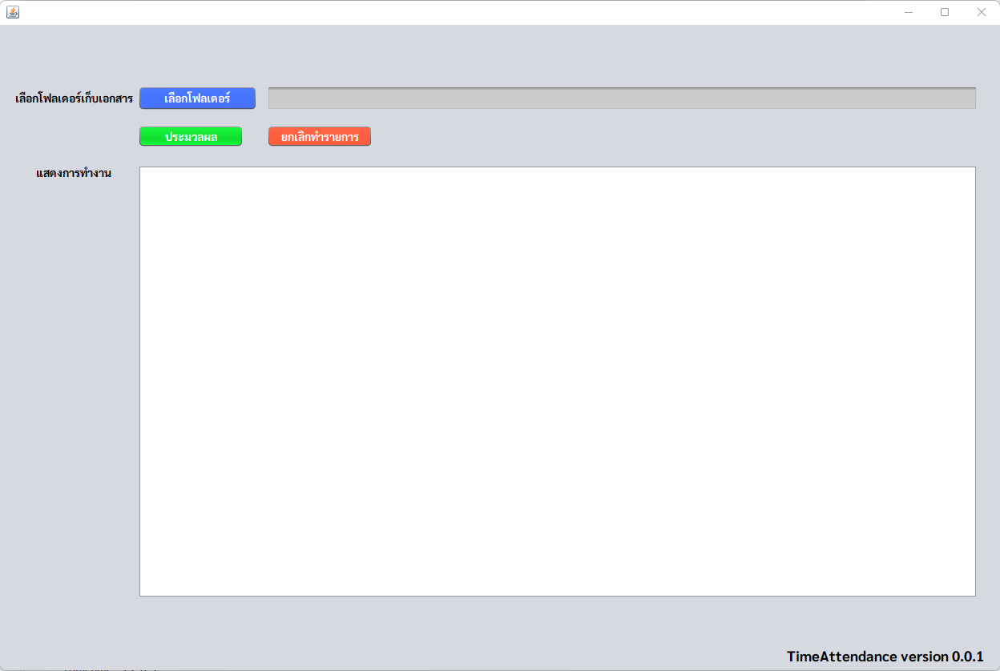
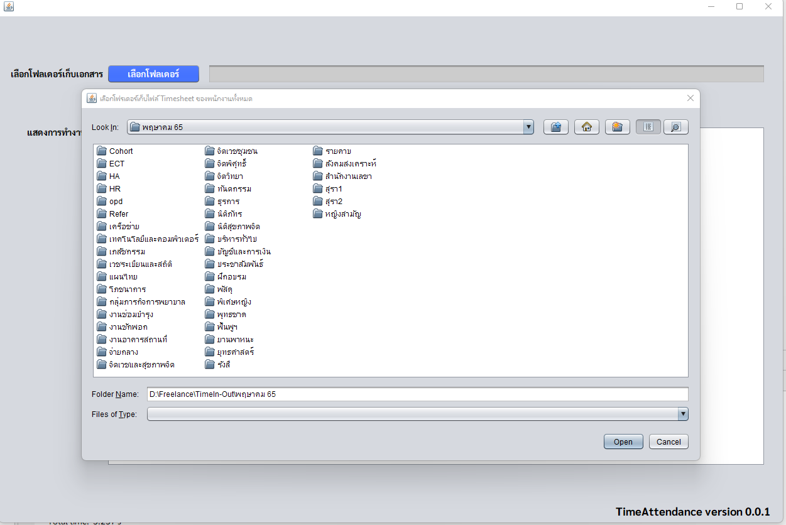
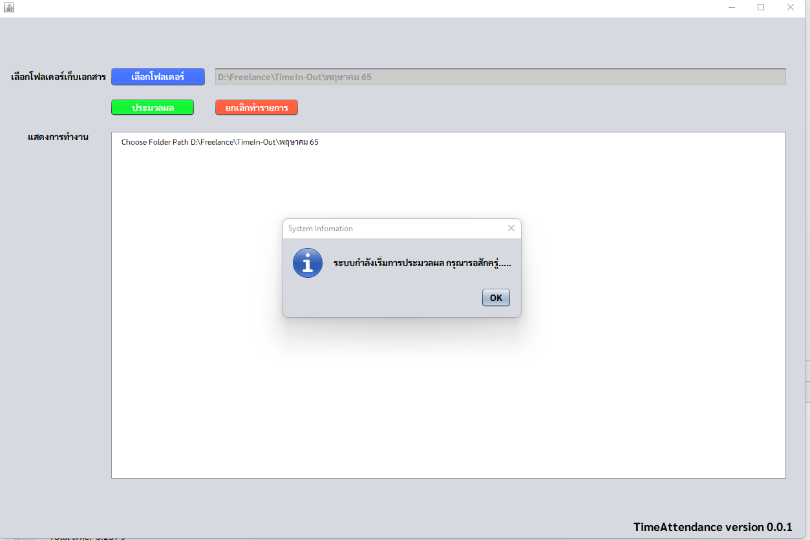
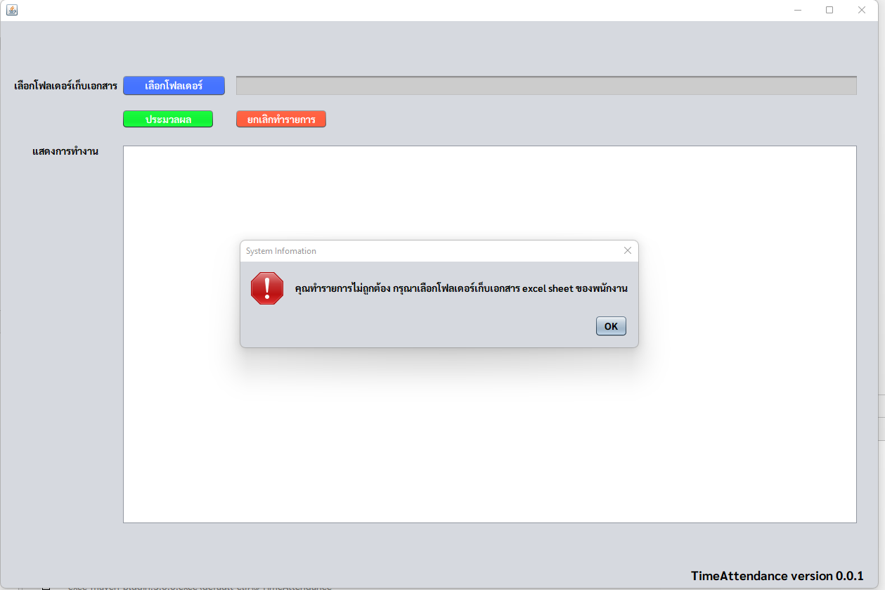
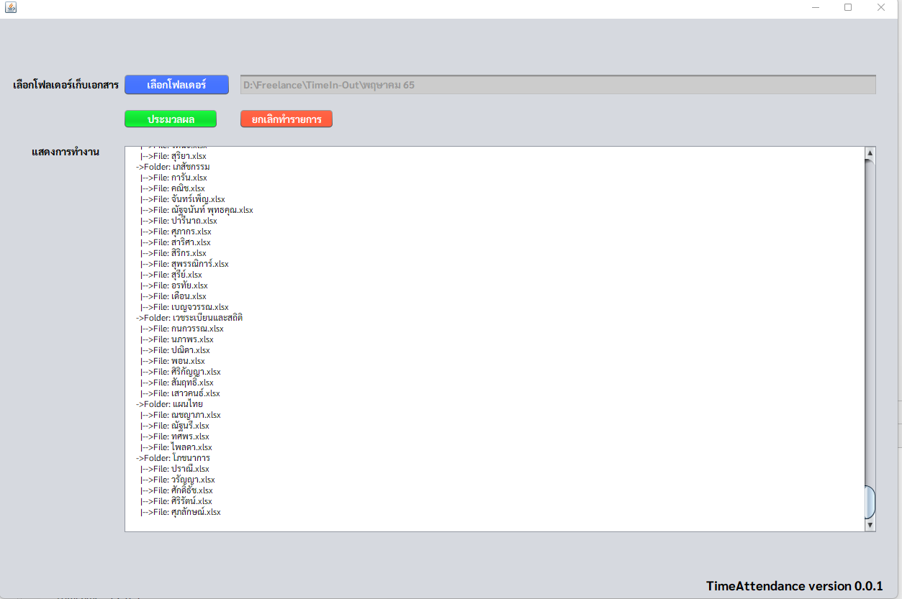

# Time-Attendence
## โปรแกรมคำนวนหาเวลาเข้างาน-ออกงาน จากข้อมูลในไฟล์ excel timesheet work time in-out
### ความต้องการของระบบ (System Requirement)
- ระบบติดตั้งแบบ client app (Desktop Application)
- เครื่อง user ต้องมีการติดตั้ง java เวอร์ชั่น 1.8 ขึ้นไป
- รองรับไฟล์ excel (.xlsx) เท่านั้น
- ระยะเวลาการพัฒนาประมาณ 2 สัปดาห์ (เริ่มนับตั้งแต่วันโอนเงินมัดจางวดแรก )
### อธิบายขั้นตอนการทางานของระบบ
- เลือก input พาธ (path) ลักษณะที่เก็บชื่อแผนก ที่เก็บไฟล์ excel (.xlsx) ทั้งหมด ผ่านทางหน้าขอโปรแกรม เช่น /path(input)
  + /path(input)/แผนก A/aaaa.xlsx
  + /path(input)/แผนก B/bbbb.xlsx
  + /path(input)/แผนก C/cccc.xlsx
--
- ระบบอ่านไฟล์ excel ทั้งหมดของแต่ละแผนก อ่านที่ละไฟล์ และภายในไฟล์จะมีแต่ละ sheets อ่านทาทั้งหมด
- ระบบ คานวณหาเวลาการเข้างาน ออกงาน และใส่ชื่อแผนก (ชื่อโฟรเดอร์ที่เก็บไฟล์)
  + Time in | Time Out | Department
- ระบบประมวลผล (process) ส่งออกไฟล์ เอ้าพุต (output) เป็น excel (.xlsx) เช่น
  + /aaaaa.xlsx -> /output/aaaaa_output.xlsx
  + /bbbbb.xlsx -> / output/bbbbb_output.xlsx
- จบขั้นตอนการทางาน
## ตัวอย่างหน้าจอของโปรแกรม บางส่วน
 
  
   
    
     
